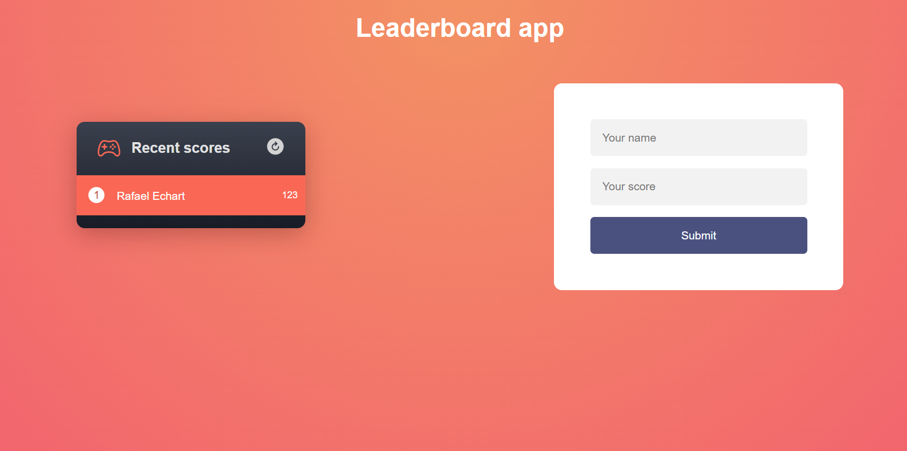
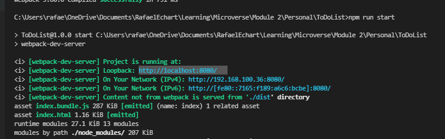

# 

# Leaderboard app

> This project is connected with an API that provides us the posibility to save new scores and read the saved scores.  
> To add a new score, fill your name and your score and click submit. 
> To see the updated scores just click the refresh button or refresh the page.  

## Built With

- HTML & CSS & Javascript
- [API: Leaderboard](https://www.notion.so/Leaderboard-API-service-24c0c3c116974ac49488d4eb0267ade3)
- Webpack and Webpack-dev-server
- Linters: Stylelint and Eslint

## Live Demo

[Live Demo Link](https://rafaelechart.github.io/Leaderboard/dist/)

## Getting Started

To get a local copy up and running follow these simple example steps.

### Prerequisites

- Node js installed
- Visual Studio Code (or any other code editor)
- Terminal
- Browser of your preference

### Setup

- git clone https://github.com/RafaelEchart/Leaderboard.git
- cd Leaderboard

### Install

Inside of your directory run the following commands:

- npm install 
- npm run build
- npm run start

### Usage

- Open your browser in http://localhost:8080/ or the port that says the CLI

### How to edit

If you wish to edit this project you need to run the following command too:

- npm watch

This will allow you to see a hot refresh in the browser when your HTML changes. 

### Run tests

- Check that all the tests are correctly passed🤝

### Merge

- Merge it with your main branch so we can all see your work!!🤝

## Authors

👤 **Rafael Echart**

- GitHub: [@rafaelechart](https://github.com/rafaelechart)
- Twitter: [@rafaechart](https://twitter.com/rafaechart)

## 🤝 Contributing

Contributions, issues, and feature requests are welcome!

## Show your support

Give a ⭐️ if you like this project!

## Acknowledgments

- Rafael Echart⭐️
- Microverse documentation ⭐️

## 📝 License

This project is [MIT](./MIT.md) licensed.
